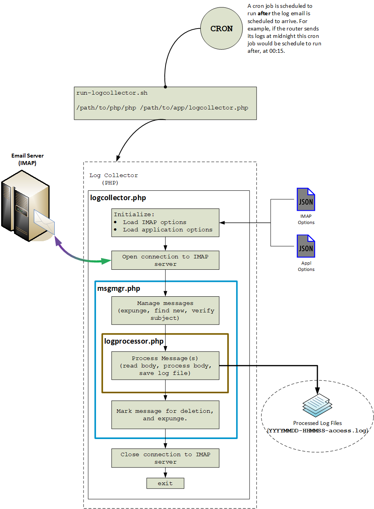
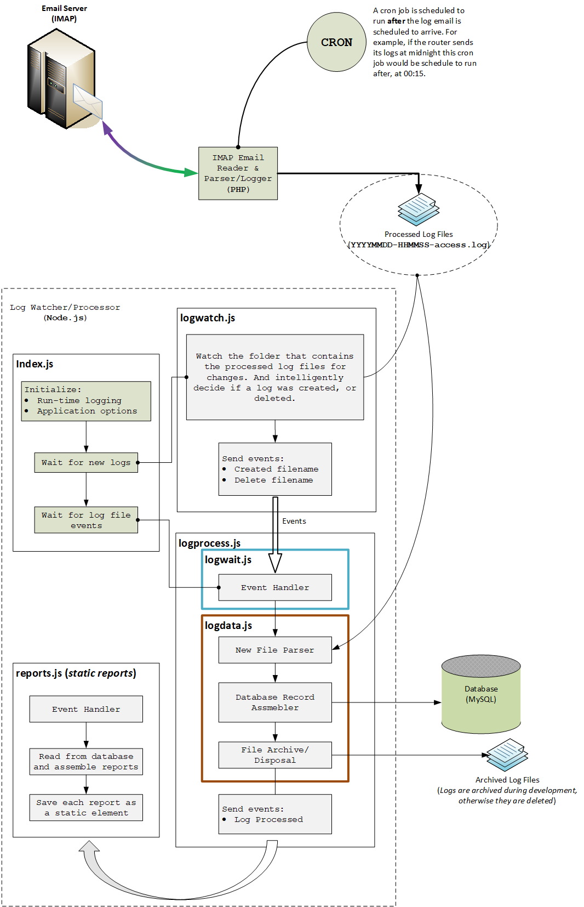

<h2>
This is project is a work in progress. Please be patient. 
</h2>

# Router Log Monitor

The purpose of this project is to aid in the monitoring of logs generated by a Netgear R6400 router. I have configured to email its log every day at midnight.

Every once in a while I would find evidence of an unauthorized access to the WiFi access point. And not having time to look through logs every day I decided to automate the process.

## Overview

The primary components are:

* A Netgear R6400 router configured to email its logs.
* An email server, must be capable of IMAP.
* A LAMP stack server **located on your local network**. I'm using a NAS as my server. Something smaller like a Raspberry Pi B+ >=3 should also work.
* A web browser capable client on your local network.

  

### Features

* Configurable
  * IMAP server settings
  * 

## PHP vs. Node.js

  

When I started the initial design of this project I investigated handling all of the imap interactions with JavaScript and Node.js. 

I did a lot of research on IMAP and the availability of libraries in NPMs or PHP. What I found kind of surprised me a bit. I *expected* that Node.js would have some up to date, and active NPMs available for use. But that's not what I found. 

* Some were unmaintained, it has been years since an issue was closed or code was updated.
* Some were just impractical. Like the self-hosted API and a library to interact with it.
* Some had a large code footprint, and were over complicated for simple use.

Please note that I am a *fan* of Node.js. I like it, I like coding for Node.js. And there are a lot of *good* NPM packages for it. But... sometimes a Node.js application is just too "fat" when compared to what it *actually does*. For example, one of the "proof of concept" applications I put together ended up using around 4 meg of space and it was only about a dozen lines of active code. Where? in the `node_modules` folder of course!

So I switched over to PHP and in a couple of hours I have something *working*. I can open the connection to the server, download headers, and download the header and message body, process the body and save it! And it *only* used about 10 **kilobytes** of space. No extra libraries, no fluff, no unused deeply hidden stuff in `node_modules` either!

And in 99% of PHP installations the proper imap module is already there. And there's also better *compatibility* across versions of PHP. The same code I write when developing and testing under 5.6 will also work without modification under PHP7.2.

So for this particular application PHP makes more sense than JavaScript on Node.js.

# Application Architecture Overview 

## Log Collector

  

### Design

## Log Watcher-Processor

  

### Design

## Database Schemas

---
