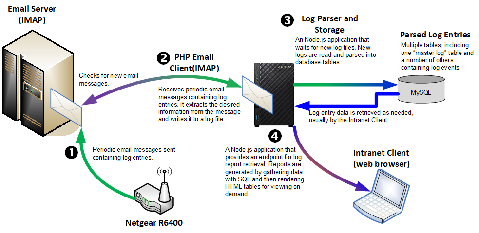

<h2>
This project is a work in progress. Please be patient. 
</h2>

# Router Log Monitor

The purpose of this project is to aid in the monitoring of logs generated by a Netgear R6400 router. I have configured it to email a log every day at midnight.

Every once in a while I would find evidence of an unauthorized access to the WiFi access point, or some other suspect activity. And not having time to look through logs every day I decided to automate the process a little. 

## Overview

The primary components in this project are:

*  A Netgear R6400 router configured to email its logs. I've set mine up to email the log daily at midnight.
*  An email server, must be capable of IMAP and reachable by the router.
*  A LAMP stack server ***with Node.js(>v12)*** **and located on your local network**. I'm using a NAS as my server. Something smaller like a Raspberry Pi B+ >=3 should also work.
*  A web browser capable client on your local network.

<p align="center">
  
</p>

There are three separate applications in this project. The first is written in PHP and its purpose is to download the log email messages and write their content to a log file. The second part is a Node.js application that watches and waits for new log files to be created. When one or more is detected this application will read the log file, parse it, and write the results to a database across multiple tables. The third part is the report generator application. It reads the data previously processed by the log watcher and provides an endpoint for retrieving various reports.

* Log Collector (`logcollector`): PHP log email message retrieval
* Log Watcher (`logwatcher`): Node.js application, parses and writes log entries to one of several tables
* Log Reporter (`logreporter`): Node.js application, creates human-readable tabular reports

### Project Folders

This is the folder structure of this project:

```
\router-log-monitor 
    |
    +---logcollector
    |
    +---logwatcher
    |   +---keys
    |   +---mysql
    |   |
    |   +---logs
    |
    +---logreporter
    |   +---mysql
    |   +---sql
    |   +---public_html
    |   |
    |   +---logs
    |
    +---logoutput
    |   +---oldlogs
    |
    +---sql
```

* **`router-log-monitor/logcollector`** : all of the PHP source and associated JSON configuration files
* **`router-log-monitor/logwatcher`** : all of the JavaScript source and associated configuration files
  * **`logwatcher/keys`** : Contains file(s) for MAC lookup API keys
  * **`logwatcher/mysql`** : MySQL functions and configuration files
  * **`logwatcher/logs`** : all run-time logs will be written here, Log.js manages the files and rolls over to the next when the current file reaches capacity(*configurable*)
* **`router-log-monitor/logreporter`** : 
  * **`logwatcher/mysql`** : MySQL functions and configuration files
  * **`logwatcher/sql`** : 
  * **`logwatcher/public_html`** : 
  * **`logwatcher/logs`** : all run-time logs will be written here, Log.js manages the files and rolls over to the next when the current file reaches capacity(*configurable*)
* **`router-log-monitor/logoutput`** : all files converted from log email messages go here
  * **`logoutput/oldlogs`** :
* **`router-log-monitor/sql`** : SQL files containing various statements for creating tables and seeding data

## Downloading this Repository

It is **strongly recommended** that you download a release instead of cloning this repository. Releases > 1.0.0 should be OK for use, anything older than that is experimental and good results are not guaranteed.

# Additional Documentation

* [Log Collector README](./logcollector/README.md)
* [Log Watcher README](./logwatcher/README.md)
* [Log Reporter README](./logreporter/README.md)

---
