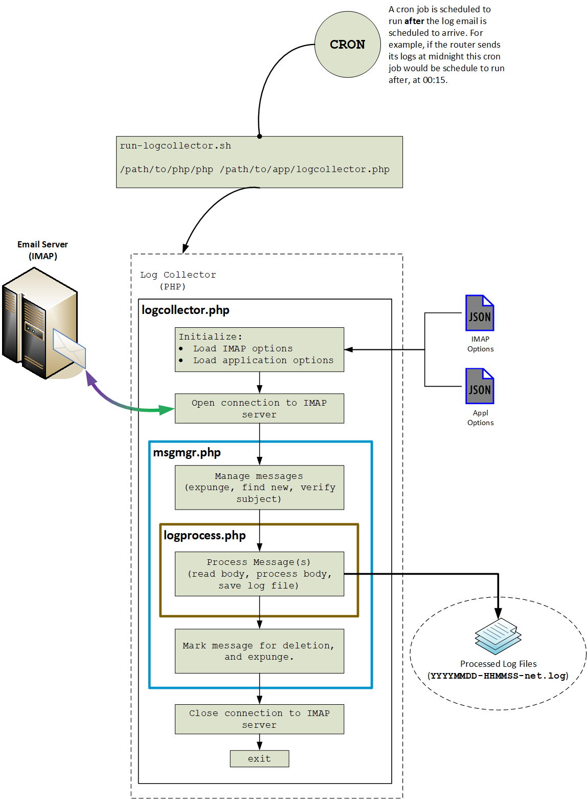

# Log Collector

When I started the initial design of this this part of the project I investigated handling all of the IMAP interactions with JavaScript and Node.js. 

I did a lot of research on IMAP and the availability of libraries in NPMs or PHP. What I found kind of surprised me a bit. I *expected* that Node.js would have some up to date, and active NPMs available for use. But that's not what I found. 

* Some were unmaintained, it has been years since an issue was closed or code was updated.
* Some were just impractical. Like the self-hosted API and a library to interact with it.
* Some had a large code footprint, and were over complicated for basic use.

Please note that I am a *fan* of Node.js. I like it, and I like coding for Node.js. There are a lot of *good* NPM packages for it. But... sometimes a Node.js application is just too "fat" when compared to what it *actually does*. For example, one of the "proof of concept" applications I put together ended up using around 4 meg of space and it was only about a dozen lines of active code. Where? in the `node_modules` folder of course!

So I switched over to PHP and in a short time I had something *working*. I can open the connection to the server, download headers, and download the header and message body, process the body and save it! And it *only* used about 10 **kilobytes** of code space. No extra libraries, no fluff, no unused deeply hidden stuff in `node_modules` either!

And in 99% of PHP installations the proper IMAP module is already there. And there's also better *compatibility* across versions of PHP. The same code I write when developing and testing under 5.6 will also work without modification under PHP 7.2.

So for this particular application PHP makes more sense than JavaScript on Node.js. Well, at least for *part* of it. There is a Node.js side to this project. Its purpose will be to finish the processing and parsing of the files that were saved by the PHP side. It will also write the parsed data to a MySQL database and generate static report content each time it finishes processing a file.

## Log Collector Architecture Overview 

<p align="center">
  
</p>

# Running the Application

## Configuration

There are two JSON formatted files used for configuration:

**`appoptions.json`**: 

```
{
    "outpath":"../logoutput/",
    "comment":"outfile must match part of 'nameregexp' in ../logwatcher/watchopt.js",
    "outfile":"net.log",
    "delunk":false,
    "procdelay":0
}
```

* `"outpath"` - The folder path to where the router log files will be saved.
* `"outfile"` - This part of the log file name must match `nameregexp` in `../logwatcher/watchopt.js`
* `"delunk"` - When false, "unknown"(*not from the router*) email messages will be marked as "seen". When true, unknown messages will be deleted.
* `"procdelay"` - The number of seconds to delay in between creating log files. Unless there is a backlog of messages to read leave this at `0`. For backlogs, values like 2 or 3 work well. Adjust it to fit your run-time environment.

**`imapaccnt.json`**: 

```
{
    "host":"mail.yourhost.something",
    "port":993,
    "login":"someone@yourhost.something",
    "pword":"passwordgoeshere",
    "folder":"",
    "comment":"the next 4 items control if, when, and how read messages are disposed.",
    "isrdonly":true,
    "disposemsg":"seen",
    "expunge":false,
    "expwhen":"onclose"
}
```

* `"host"` - Your mail host.
* `"port"` - Mail host port number, 993 is typical.
* `"login"` - Your email account login.
* `"pword"` - Your email account password.
* `"folder"` - The **IMAP folder** on the host where the router log email messages are.
* `"comment"` - N/A
* `"isrdonly"` - `true` or `false`
  * `true` - If the mailbox is to be opened as "read only", and no changes will be made to its messages. The IMAP connection is opened with `OP_READONLY`. 
  * `false` - If not "read only", then look at how a just-read message is to be handled. Either mark it as "seen" or mark it as "deleted".
* `"disposemsg"` - `'seen'` or `'delete'`, checked if `"isrdonly"` is **false**
  * `'seen'` - mark messages as "seen"
  * `'delete'` - mark messages for deletion
* `"expunge"` - `true` or `false`, if there messages are to be expunged (*either previously or currently marked as "deleted"*) then check `"expwhen"` for when to expunge.
  * `true` - expunge marked messages
  * `false` - do not expunge
* `"expwhen"` - `'onclose'`, `'readbegin'`, or `'readend'`
  * `'onclose'` - messages will be expunged when the connection to the IMAP mail server is closed
  * `'readbegin'` - messages will be expunged just before the message headers are read
  * `'readend'` - messages will be expunged after all messages have been read and/or marked

Examples:

1) Read messages, do not make changes

```
    "isrdonly":true,
    "disposemsg":"seen",
    "expunge":false,
    "expwhen":"onclose"
```

`"disposemsg"`, `"expunge"`, and `"expwhen"` will be ignored. No changes will be made to the IMAP folder (`"folder"`) and its messages.

2) Read messages, mark as "seen"
```
    "isrdonly":false,
    "disposemsg":"seen",
    "expunge":false,
    "expwhen":"onclose"
```

`"expunge"`, and `"expwhen"` will be ignored. Messages will only be marked as "seen" after they are read.

3) Read messages, mark for deletion
```
    "isrdonly":false,
    "disposemsg":"delete",
    "expunge":false,
    "expwhen":"onclose"
```

Same as #2 above, but messages will only be marked for "deletion" after they are read. The messages will not be deleted(*expunged*), just marked.

4) Read messages, mark for deletion and expunge

```
    "isrdonly":false,
    "disposemsg":"delete",
    "expunge":true,
    "expwhen":"onclose"
```

Messages that have been marked for "deletion" will be removed when the application closes the IMAP connection.

**TIP**: Save your configuration file with a name beginning with an underscore ('_'). The `.gitignore` file in the parent directory of this repository will "hide" it from GitHub so that there is less chance of it accidentally getting checked in.

### CRON

This will run the logcollector at 00:15am every day:

`15 0 * * * /path/to/run-logcollector.sh`

My Linux platform is a NAS running BusyBox so my script may not work for you. But it is provided as an example:

```
#!/bin/sh
#
# NOTE: This file is specific to the NAS platform that I
# use. It will likely require modification to work on any
# other platform.
# 
# This command should be run as a CRON job at an interval 
# of once per day.
/usr/builtin/bin/php /volume1/NodeSrv/apps/rlmonitor/logcollector/logcollector.php
```
### Command Line

Run it with the following command from within the `/logcollector` folder:

`php logcollector.php`

### Console Output


